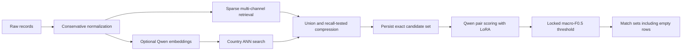

# Qwen pipeline formulation

This document describes the broader design, including optional extensions. The executable lexical/Qwen pipeline and synthetic integration checks are implemented; see README.md for the supported workflow and remaining limits. Pretrained-model training and full-data processing have not run. A tiny randomly initialized Qwen3/LoRA model has exercised training and scoring on a synthetic fixture.

## Objective and architecture

For each Source 1 reference, predict a set of Source 2/3 IDs. Optimize macro-F0.5 over all references, including empty true sets. Use Qwen3-Reranker-0.6B as the sole pair matcher, with a learned LoRA adapter. Its multilingual checkpoint and permissive license are relevant initialization properties; they are not evidence of achieved accuracy on this dataset.

All retained candidate pairs go through Qwen. There is no learned secondary pair scorer, feature stacker, automatic positive acceptance path, forced top-one assignment, or graph closure in the initial implementation. Lexical similarity, numeric evidence, and retrieval ranks are used for retrieval, diagnostics, and negative selection. Structured values remain visible in the record text; they do not feed a separate classifier.

## Data and split contracts

The actual inputs have `entity_id`, `business_name`, `business_address`, and `country`. Source comes from the ID prefix/file. The six files contain 24,229,173 business records; ground-truth rows are supervision and are not additional records to normalize. Training has 2,206,821 labeled references and 7,638,365 positive links. Test has 1,732,544 references and 9,969,589 external records. France is present only at test time.

Audit ID existence, duplicate rows, truth completeness assumptions, cross-country true pairs, and external-record ownership before selecting hard partitions. Country is an open string label. Preserve all distinct external IDs even when content can share an embedding or a pair-score computation.

Persist four disjoint groups of complete reference entities: fit, early_stop, threshold_tune, and holdout. Stratify by country, singleton status, and match-count bucket. If multiple references own one external record, resolve/group that component before splitting. For strict entity-disjoint evaluation, external positives owned by held-out references must not enter supervised fitting even as negative examples. They may remain in the label-free retrieval corpus. An explicit owner/split mask enforces this, rather than assuming a query split also splits external records.

The early-stop partition selects training settings/checkpoints. The threshold-tune partition selects the final threshold. Holdout is used for the locked pipeline report, not for repeated architecture selection. Country-transfer tests require separate recorded runs (US to India and India to US); neither measures French accuracy. French parser/tokenization/candidate diagnostics remain label-free. New-country decisions fall back to the global policy.

## Cleaning and representation

`01_data_cleaning.ipynb` owns the transformations. Keep three views: raw text, conservative native-script normalized text for Qwen, and more aggressive lexical variants for retrieval. Do not replace the neural input with suffix-stripped/transliterated text alone. Preserve initials, branch numbers, leading zeros, missing addresses, punctuation with meaning, and the available country label. Missing fields get explicit markers; entity IDs are excluded from model text.

Derived address parts have reliability flags. Contradictory numbers are evidence to learn from, not unconditional vetoes. Shared names do not establish business identity, and the precise branch/location interpretation must be checked against labels. Do not invent unavailable phones, websites, coordinates, or categories, or fetch business identities externally.

Bind normalized caches to input hashes, cleaning version, schema and configuration. Write complete shards atomically; verify all listed shards when resuming.

## Candidate generation

Combine name/address BM25 or weighted tokens, character n-grams, preserved initials/joined names, and address/numeric anchors. Use country partitions only after the label audit; region/postcode agreement supplies additional channels instead of mandatory conjunctions. Deduplicate by external ID. Use deterministic reciprocal-rank fusion (initial constant 60) and stable ID tie-breaking; tune candidate quotas on development groups for recall and scoring cost.

Inspect candidates at caps 10, 20, and 40, plus the pre-compression union. These are experiments, not a chosen cap. Define an inference-time overflow rule before finalizing the retriever. Overflow cannot recover an ID already removed from an earlier proposal pool, so report truncation at every stage.

Evaluate sampled references against the full 10,320,219-record training external pool. Do not insert missing positives into evaluated candidates. Report pair/macro recall, any/all-match coverage, per-reference oracle F0.5, zero-candidate rate, p50/p95/p99/max candidate counts and runtime/memory by channel and country.

Optional dense rescue uses frozen Qwen3-Embedding-0.6B with a pinned revision, normalized vectors, country ANN indexes and recorded query instructions. Adopt it only after measured post-compression recall gain and total encoding/index cost justify it. Task adaptation, if later adopted, uses a multi-positive contrastive objective, excluding every known sibling from negatives and fitting only on training groups; indexes must match each trained encoder. Same-source records are not automatically negative examples. Frozen indexes can be reused across folds; supervised encoders require the corresponding split-specific work.

## Qwen matching and training

Use a field-labeled pair containing reference and candidate names, addresses and countries. Adapt the official reranker prompt to business identity matching. Keep one versioned instruction and input builder for training, validation and inference. Safely escape embedded control markers in data. Reserve tokens for both records and the answer suffix; measure field-specific truncation rather than blindly truncating the whole concatenation.

At the final non-padding prompt position, calculate `z = logit(yes) - logit(no)`. Train `BCEWithLogits(z, label)` independently for each pair. This is not a softmax over candidates, and it does not require free-text generation. Validate that the pinned tokenizer's answer IDs are the intended single tokens. Left padding keeps the final prompt position at the last column; other padding arrangements require an explicit last-valid-token gather.

The sigmoid of z is a score, not an automatically calibrated match probability after negative sampling. Use raw z for the initial global threshold sweep. A threshold on raw logits and the equivalent sigmoid threshold produce the same ordering; store which score space the policy expects.

Start with the LoRA/AdamW settings in config.json. Normalize supervised loss contributions per reference so high-cardinality or heavily sampled groups do not dominate. Include all known positives for the selected fit references and a bounded mix of retrieved hard negatives, easy same-country negatives, and singleton candidate negatives. Supplementary positives outside retrieval may teach the matcher, but their provenance stays separate from retrieval measurements. Downstream evaluation includes all missing true matches.

Mine hard negatives from fit references, using labels to exclude all true matches and the owner/split mask to exclude held-out entities. Refresh once after warm-up by scoring a fixed mining pool. The refresh model never trains on evaluation labels. Do not create synthetic equivalence labels or use test outcomes for training.

Save adapter checkpoints, optimizer/scheduler/scaler states, RNG states, data cursor, sampler configuration, best-checkpoint criterion, base/tokenizer revision and hashes. Pin the dependency environment after runtime selection. Resolve revision nulls to immutable commits before loading training weights; an adapter trained on one base revision must not silently load another.

## Evaluation and empty-set decisions

For gold count g, predicted count k and true positives t, per-reference F0.5 is `1.25*t/(0.25*g+k)`, with `g=k=0` assigned 1. Average references, not pairs. Include zero-candidate references and positives outside the candidate set.

Select the global raw-logit threshold by descending distinct-score sweep, treating tied scores together and including the all-empty policy. Predict every candidate whose score is at least the threshold; emit an empty set when none pass. Multiple candidates can pass. This handles singleton output without a separate classifier. Do not assume 0.5 sigmoid probability or zero raw logit is optimal.

Any future supported group thresholds or calibration require their own development evidence and the global fallback. If a model is refit after policy tuning, its score distribution can change: re-establish the policy on a disjoint retained tuning set instead of silently reusing a threshold from another checkpoint.

## Artifact contracts and inference

| Artifact | Required information |
| --- | --- |
| Normalized shards | IDs, source/country, raw/native/lexical views, parse quality, normalization hash |
| Split manifest | Every evaluated reference, complete match count, singleton flag, split and ownership rules |
| Candidate shards | Reference/external ID, retrieval channel scores/ranks, final inclusion and retriever hash |
| Training pairs | IDs, binary label, reference weight, negative/positive provenance and split |
| Model manifest | Base/tokenizer immutable revision, adapter hash, prompt/serialization/token-cap contract, dependencies |
| Scored shards | IDs, finite raw yes/no logit difference, checkpoint/prompt/retriever hashes |
| Decision policy | Score space, comparator, threshold or explicit predict-none policy, tuning-set/model hashes |
| Run manifest | Expected/completed shard counts, input/output hashes, timings, memory and actual cost |

Inference uses the same adapter, prompt, tokenization and score definition as tuning. Batch by token length while preserving IDs. Score every final candidate, retry only incomplete shards, and detect missing/duplicate score rows before decision application. Identical content may share computation only when all distinct IDs are expanded afterward.

Export `candidate_pairs.tsv` from the exact pre-matcher candidate set and `matching_results.tsv` from its accepted subset. Enforce one row per test reference, valid external IDs, no duplicate IDs, and exact headers/tab delimiters. Candidate absence and subset violations are hard errors internally. The supplied validator's optional ID checks and warnings require explicit follow-up, not just its exit status.

## Compute gate

The old report's compute estimate cannot simply be reused after changing the matcher. At mean candidate count K, test scoring volume is `1,732,544*K`, before optional duplicate-content reuse. At K=40 this is 69,301,760 pairs. Required GPU hours are actual pairs divided by measured end-to-end pairs/second and 3600. Include training/validation scoring, tokenization, I/O, repeated experiments and both training/test indexes in the budget.

Benchmark a representative short job before a full run. LoRA reduces trainable parameters; it does not remove base-model forward computation or guarantee fast inference. Prefer length-bucketed batches, bounded shards, and validated adapter merging where useful. Do not silently lower recall or score only an undocumented subset to fit a runtime target. If the measured total exceeds the planning allowance, make the measured recall/cost frontier explicit before choosing a revised configuration.

## Primary references

- [Qwen3-Reranker-0.6B model card and scoring example](https://huggingface.co/Qwen/Qwen3-Reranker-0.6B)
- [Qwen3-Embedding-0.6B](https://huggingface.co/Qwen/Qwen3-Embedding-0.6B)
- [PEFT LoRA API](https://huggingface.co/docs/peft/en/package_reference/lora)
- [Controlled 2026 entity-matching study](https://arxiv.org/abs/2607.24688)

The independent BCE adaptation, retrieval configuration, budget gates, and macro-F0.5 policy are this project's proposed design. General retrieval benchmark results are not claimed as business-resolution results.
